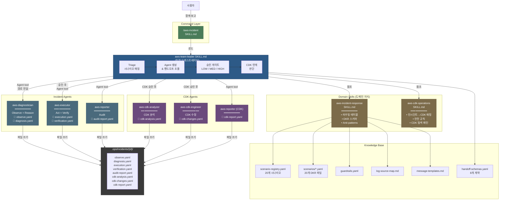
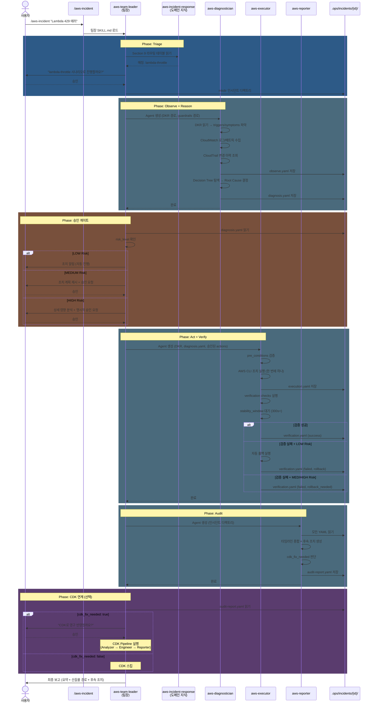
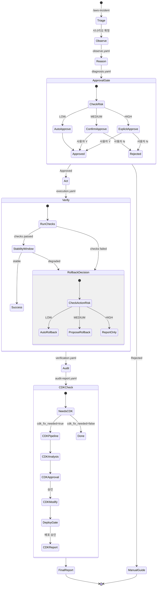
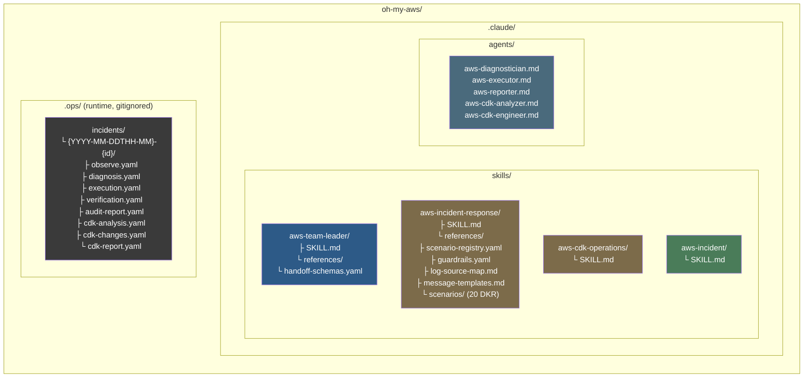

d# oh-my-aws Harness Architecture Diagrams

## 1. 전체 구조 (Skill / Agent / Flow)

```mermaid
graph TB
    User["사용자"]
    
    subgraph Command["Command Layer"]
        CMD["/aws-incident<br/>SKILL.md"]
    end

    subgraph TeamLeader["aws-team-leader SKILL.md<br/>(팀장 오케스트레이터)"]
        direction LR
        Triage["Triage<br/>시나리오 매칭"]
        Spawn["Agent 생성<br/>& 핸드오프 조율"]
        Gate["승인 게이트<br/>LOW / MED / HIGH"]
        CDKLink["CDK 연계<br/>판단"]
        Triage --> Spawn --> Gate --> CDKLink
    end

    subgraph Skills["Domain Skills (도메인 지식)"]
        IR["aws-incident-response<br/>SKILL.md<br/>━━━━━━━━━━<br/>• 라우팅 테이블<br/>• DKR 스키마<br/>• Anti-patterns"]
        CDKOps["aws-cdk-operations<br/>SKILL.md<br/>━━━━━━━━━━<br/>• 인시던트→CDK 매핑<br/>• 안전 규칙<br/>• CDK 탐색 패턴"]
    end

    subgraph Knowledge["Knowledge Base"]
        Registry["scenario-registry.yaml<br/>20개 시나리오"]
        DKR["scenarios/*.yaml<br/>20개 DKR 파일"]
        Guard["guardrails.yaml"]
        LogMap["log-source-map.md"]
        MsgTpl["message-templates.md"]
        Handoff["handoff-schemas.yaml<br/>8개 계약"]
    end

    subgraph IncidentAgents["Incident Agents"]
        Diag["aws-diagnostician<br/>━━━━━━━━━━<br/>Observe + Reason<br/>📄 observe.yaml<br/>📄 diagnosis.yaml"]
        Exec["aws-executor<br/>━━━━━━━━━━<br/>Act + Verify<br/>📄 execution.yaml<br/>📄 verification.yaml"]
        Report["aws-reporter<br/>━━━━━━━━━━<br/>Audit<br/>📄 audit-report.yaml"]
    end

    subgraph CDKAgents["CDK Agents"]
        Analyzer["aws-cdk-analyzer<br/>━━━━━━━━━━<br/>CDK 분석<br/>📄 cdk-analysis.yaml"]
        Engineer["aws-cdk-engineer<br/>━━━━━━━━━━<br/>CDK 수정<br/>📄 cdk-changes.yaml"]
        ReportCDK["aws-reporter (CDK)<br/>━━━━━━━━━━<br/>📄 cdk-report.yaml"]
    end

    subgraph OpsDir[".ops/incidents/{id}/"]
        Files["observe.yaml<br/>diagnosis.yaml<br/>execution.yaml<br/>verification.yaml<br/>audit-report.yaml<br/>cdk-analysis.yaml<br/>cdk-changes.yaml<br/>cdk-report.yaml"]
    end

    User -->|"장애 보고"| CMD
    CMD -->|"로드"| TeamLeader
    TeamLeader -->|"참조"| IR
    TeamLeader -->|"참조"| CDKOps
    IR --> Registry
    IR --> DKR
    IR --> Guard
    IR --> LogMap
    IR --> MsgTpl
    TeamLeader --> Handoff

    TeamLeader -->|"Agent tool<br/>경로 전달"| Diag
    TeamLeader -->|"승인 후<br/>Agent tool"| Exec
    TeamLeader -->|"Agent tool"| Report
    TeamLeader -->|"CDK 승인 후"| Analyzer
    TeamLeader -->|"CDK 승인 후"| Engineer
    TeamLeader -->|"Agent tool"| ReportCDK

    Diag -->|"파일 쓰기"| OpsDir
    Exec -->|"파일 쓰기"| OpsDir
    Report -->|"파일 쓰기"| OpsDir
    Analyzer -->|"파일 쓰기"| OpsDir
    Engineer -->|"파일 쓰기"| OpsDir
    ReportCDK -->|"파일 쓰기"| OpsDir

    style TeamLeader fill:#2d5a87,stroke:#1a3a5c,color:#fff
    style CMD fill:#4a7c59,stroke:#2d5a3a,color:#fff
    style IR fill:#7c6b4a,stroke:#5a4a2d,color:#fff
    style CDKOps fill:#7c6b4a,stroke:#5a4a2d,color:#fff
    style Diag fill:#4a6a7c,stroke:#2d4a5a,color:#fff
    style Exec fill:#4a6a7c,stroke:#2d4a5a,color:#fff
    style Report fill:#4a6a7c,stroke:#2d4a5a,color:#fff
    style Analyzer fill:#6a4a7c,stroke:#4a2d5a,color:#fff
    style Engineer fill:#6a4a7c,stroke:#4a2d5a,color:#fff
    style ReportCDK fill:#6a4a7c,stroke:#4a2d5a,color:#fff
    style OpsDir fill:#3a3a3a,stroke:#1a1a1a,color:#fff
```

## 2. 인시던트 파이프라인 시퀀스

```mermaid
sequenceDiagram
    actor User as 사용자
    participant CMD as /aws-incident
    participant TL as aws-team-leader<br/>(팀장)
    participant IR as aws-incident-response<br/>(도메인 지식)
    participant Diag as aws-diagnostician
    participant Exec as aws-executor
    participant Rep as aws-reporter
    participant Ops as .ops/incidents/{id}/

    User->>CMD: /aws-incident "Lambda 429 에러"
    CMD->>TL: 팀장 SKILL.md 로드

    rect rgb(45, 90, 135)
        Note over TL,IR: Phase: Triage
        TL->>IR: Section 9 라우팅 테이블 읽기
        IR-->>TL: 매칭: lambda-throttle
        TL->>User: "lambda-throttle 시나리오로 진행할까요?"
        User-->>TL: 승인
        TL->>Ops: mkdir 인시던트 디렉토리
    end

    rect rgb(74, 106, 124)
        Note over TL,Diag: Phase: Observe + Reason
        TL->>Diag: Agent 생성 (DKR 경로, guardrails 경로)
        Diag->>Diag: DKR 읽기 → triggers/symptoms 파악
        Diag->>Diag: CloudWatch 로그/메트릭 수집
        Diag->>Diag: CloudTrail 변경 이력 조회
        Diag->>Ops: observe.yaml 저장
        Diag->>Diag: Decision Tree 탐색 → Root Cause 결정
        Diag->>Ops: diagnosis.yaml 저장
        Diag-->>TL: 완료
    end

    rect rgb(120, 80, 60)
        Note over TL,User: Phase: 승인 게이트
        TL->>Ops: diagnosis.yaml 읽기
        TL->>TL: risk_level 확인

        alt LOW Risk
            TL->>User: 조치 알림 (자동 진행)
        else MEDIUM Risk
            TL->>User: 조치 계획 제시 + 승인 요청
            User-->>TL: 승인
        else HIGH Risk
            TL->>User: 상세 영향 분석 + 명시적 승인 요청
            User-->>TL: 승인
        end
    end

    rect rgb(74, 106, 124)
        Note over TL,Exec: Phase: Act + Verify
        TL->>Exec: Agent 생성 (DKR, diagnosis.yaml, 승인된 actions)
        Exec->>Exec: pre_conditions 검증
        Exec->>Exec: AWS CLI 조치 실행 (한 번에 하나)
        Exec->>Ops: execution.yaml 저장
        Exec->>Exec: verification checks 실행
        Exec->>Exec: stability_window 대기 (300s+)

        alt 검증 성공
            Exec->>Ops: verification.yaml (success)
        else 검증 실패 + LOW Risk
            Exec->>Exec: 자동 롤백 실행
            Exec->>Ops: verification.yaml (failed, rollback)
        else 검증 실패 + MED/HIGH Risk
            Exec->>Ops: verification.yaml (failed, rollback_needed)
        end
        Exec-->>TL: 완료
    end

    rect rgb(74, 106, 124)
        Note over TL,Rep: Phase: Audit
        TL->>Rep: Agent 생성 (인시던트 디렉토리)
        Rep->>Ops: 모든 YAML 읽기
        Rep->>Rep: 타임라인 종합 + 후속 조치 생성
        Rep->>Rep: cdk_fix_needed 판단
        Rep->>Ops: audit-report.yaml 저장
        Rep-->>TL: 완료
    end

    rect rgb(90, 60, 110)
        Note over TL,User: Phase: CDK 연계 (선택)
        TL->>Ops: audit-report.yaml 읽기
        alt cdk_fix_needed: true
            TL->>User: "CDK로 영구 반영할까요?"
            User-->>TL: 승인
            Note over TL: CDK Pipeline 실행<br/>(Analyzer → Engineer → Reporter)
        else cdk_fix_needed: false
            Note over TL: CDK 스킵
        end
    end

    TL->>User: 최종 보고 (요약 + 산출물 경로 + 후속 조치)
```

## 3. 파일 핸드오프 데이터 플로우

```mermaid
flowchart LR
    subgraph Diagnostician
        O["observe.yaml"]
        D["diagnosis.yaml"]
    end

    subgraph TeamLeader["팀장 (승인 게이트)"]
        Gate{"risk_level?"}
    end

    subgraph Executor
        E["execution.yaml"]
        V["verification.yaml"]
    end

    subgraph Reporter
        A["audit-report.yaml"]
    end

    subgraph CDK["CDK Pipeline (선택)"]
        CA["cdk-analysis.yaml"]
        CC["cdk-changes.yaml"]
        CR["cdk-report.yaml"]
    end

    O -->|"메트릭/로그/변경이력"| D
    D -->|"root_cause + actions"| Gate
    Gate -->|"LOW: 자동"| E
    Gate -->|"MED: 확인"| E
    Gate -->|"HIGH: 명시적"| E
    E -->|"실행 결과"| V
    V -->|"검증 결과"| A
    D -->|"진단 근거"| A
    O -->|"관측 데이터"| A
    E -->|"조치 기록"| A

    A -->|"cdk_fix_needed?"| CA
    CA -->|"변경 대상"| CC
    CC -->|"diff 결과"| CR

    style Gate fill:#7c4a2d,stroke:#5a2d1a,color:#fff
    style O fill:#4a6a7c,stroke:#2d4a5a,color:#fff
    style D fill:#4a6a7c,stroke:#2d4a5a,color:#fff
    style E fill:#4a7c5a,stroke:#2d5a3a,color:#fff
    style V fill:#4a7c5a,stroke:#2d5a3a,color:#fff
    style A fill:#7c7c4a,stroke:#5a5a2d,color:#fff
    style CA fill:#6a4a7c,stroke:#4a2d5a,color:#fff
    style CC fill:#6a4a7c,stroke:#4a2d5a,color:#fff
    style CR fill:#6a4a7c,stroke:#4a2d5a,color:#fff
```

## 4. 승인 게이트 상태 머신

```mermaid
stateDiagram-v2
    [*] --> Triage: /aws-incident

    Triage --> Observe: 시나리오 확정
    Observe --> Reason: observe.yaml

    Reason --> ApprovalGate: diagnosis.yaml
    
    state ApprovalGate {
        [*] --> CheckRisk
        CheckRisk --> AutoApprove: LOW
        CheckRisk --> ConfirmApprove: MEDIUM
        CheckRisk --> ExplicitApprove: HIGH
        AutoApprove --> Approved
        ConfirmApprove --> Approved: 사용자 Y
        ConfirmApprove --> Rejected: 사용자 N
        ExplicitApprove --> Approved: 사용자 Y
        ExplicitApprove --> Rejected: 사용자 N
    }

    ApprovalGate --> Act: Approved
    ApprovalGate --> ManualGuide: Rejected

    Act --> Verify: execution.yaml

    state Verify {
        [*] --> RunChecks
        RunChecks --> StabilityWindow: checks passed
        RunChecks --> RollbackDecision: checks failed
        StabilityWindow --> Success: stable
        StabilityWindow --> RollbackDecision: degraded
        
        state RollbackDecision {
            [*] --> CheckActionRisk
            CheckActionRisk --> AutoRollback: LOW
            CheckActionRisk --> ProposeRollback: MEDIUM
            CheckActionRisk --> ReportOnly: HIGH
        }
    }

    Verify --> Audit: verification.yaml
    Audit --> CDKCheck: audit-report.yaml

    state CDKCheck {
        [*] --> NeedsCDK
        NeedsCDK --> CDKPipeline: cdk_fix_needed=true
        NeedsCDK --> Done: cdk_fix_needed=false
        CDKPipeline --> CDKAnalysis
        CDKAnalysis --> CDKApproval
        CDKApproval --> CDKModify: 승인
        CDKModify --> DeployGate
        DeployGate --> CDKReport: 배포 승인
    }

    CDKCheck --> FinalReport
    FinalReport --> [*]
    ManualGuide --> [*]
```

## 5. 디렉토리 구조

```mermaid
graph LR
    subgraph Root["oh-my-aws/"]
        subgraph Claude[".claude/"]
            subgraph SkillsDir["skills/"]
                TL["aws-team-leader/<br/>├ SKILL.md<br/>└ references/<br/>  └ handoff-schemas.yaml"]
                IR2["aws-incident-response/<br/>├ SKILL.md<br/>└ references/<br/>  ├ scenario-registry.yaml<br/>  ├ guardrails.yaml<br/>  ├ log-source-map.md<br/>  ├ message-templates.md<br/>  └ scenarios/ (20 DKR)"]
                CDK2["aws-cdk-operations/<br/>└ SKILL.md"]
                INC["aws-incident/<br/>└ SKILL.md"]
            end
            subgraph AgentsDir["agents/"]
                AG["aws-diagnostician.md<br/>aws-executor.md<br/>aws-reporter.md<br/>aws-cdk-analyzer.md<br/>aws-cdk-engineer.md"]
            end
        end
        subgraph OpsRT[".ops/ (runtime, gitignored)"]
            IDir["incidents/<br/>└ {YYYY-MM-DDTHH-MM}-{id}/<br/>  ├ observe.yaml<br/>  ├ diagnosis.yaml<br/>  ├ execution.yaml<br/>  ├ verification.yaml<br/>  ├ audit-report.yaml<br/>  ├ cdk-analysis.yaml<br/>  ├ cdk-changes.yaml<br/>  └ cdk-report.yaml"]
        end
    end

    style TL fill:#2d5a87,color:#fff
    style IR2 fill:#7c6b4a,color:#fff
    style CDK2 fill:#7c6b4a,color:#fff
    style INC fill:#4a7c59,color:#fff
    style AG fill:#4a6a7c,color:#fff
    style IDir fill:#3a3a3a,color:#fff
```
